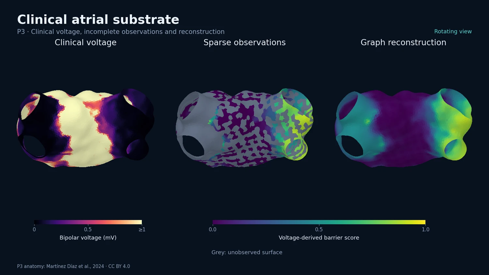
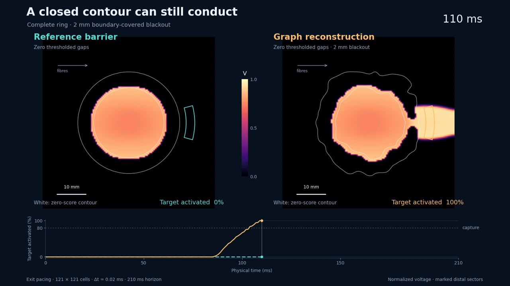
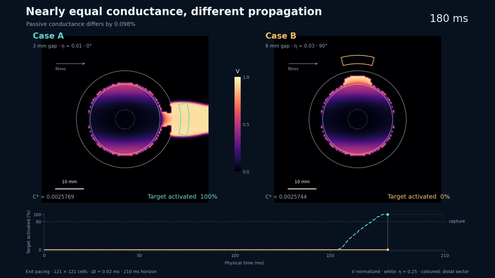
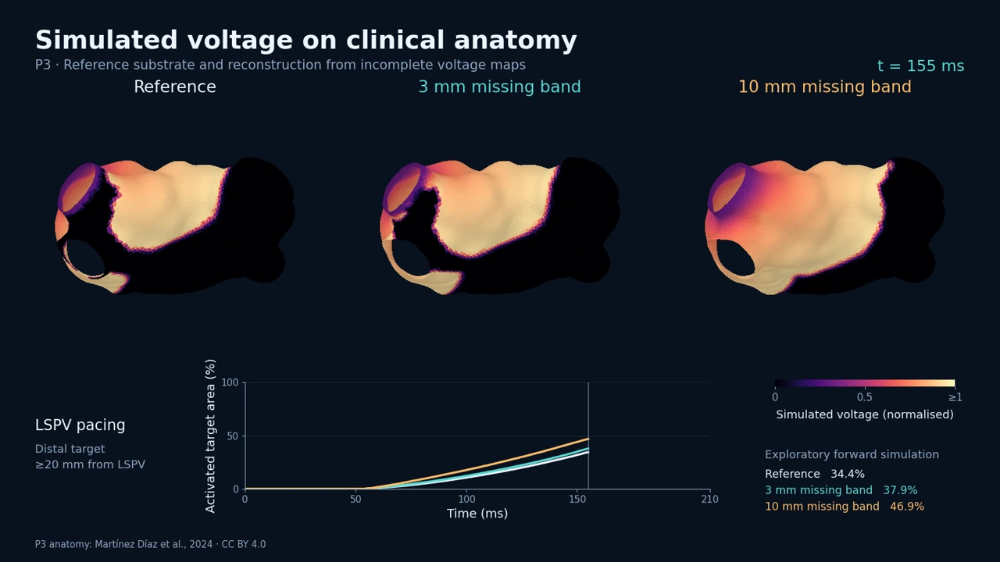

# Reconstructing atrial conduction barriers from sparse observations using an anisotropic phase-field model

Andrej Novak

**[Explore the interactive website](https://andrejno.github.io/atrial-conduction-barriers/)** · [Executed notebook](notebooks/Atrial_Reconstruction.ipynb) · [Simulation code](code/)

Sparse measurements can miss residual conduction pathways. We reconstruct a continuous atrial substrate field, then test the electrical propagation it supports. The study combines mathematical analysis, controlled ring experiments and six clinical left-atrial voltage maps.

[](https://andrejno.github.io/atrial-conduction-barriers/interactive/clinical.html)

[Rotate the clinical atrium and compare fields](https://andrejno.github.io/atrial-conduction-barriers/interactive/clinical.html) · [Watch the rotating reconstruction](https://andrejno.github.io/atrial-conduction-barriers/videos/patient_reconstruction_rotation.mp4)

## Main results

**Observation coverage matters most.** Across six clinical maps, narrowing the withheld band from 10 to 3 mm reduced the graph method’s mean absolute normalized conductance error from 0.353 to 0.163, a 54% reduction. The active correction had much smaller effects, depending on the quantity measured.

| A closed ring can still conduct | Similar conductance, different propagation |
| --- | --- |
| [](https://andrejno.github.io/atrial-conduction-barriers/interactive/rings.html?case=closed) | [](https://andrejno.github.io/atrial-conduction-barriers/interactive/rings.html?case=matched) |
| The reconstructed ring was closed after thresholding, yet transmitted excitation that the reference barrier blocked. | Two gaps differed in passive conductance by only 0.0975%, yet produced different exit-paced capture outcomes. |
| [Explore the simulation](https://andrejno.github.io/atrial-conduction-barriers/interactive/rings.html?case=closed) | [Compare the computed fields](https://andrejno.github.io/atrial-conduction-barriers/interactive/rings.html?case=matched) |

Both exit-paced distinctions persisted across the tested grids. The matched-pair entrance response was more sensitive to spatial resolution. Capture requires 80% distal activation by 210 ms.

**Missing observations also affect propagation on real anatomy.** On P3, narrowing the withheld band reduced simulated arrival-time RMSE from 22.36 to 6.69 ms against the voltage-derived reference simulation. These isotropic patient-anatomy calculations remain exploratory: mesh refinement changed absolute arrivals by approximately 12–14 ms.

[](https://andrejno.github.io/atrial-conduction-barriers/videos/patient_voltage_propagation.mp4)

[Watch propagation on P3](https://andrejno.github.io/atrial-conduction-barriers/videos/patient_voltage_propagation.mp4)

## Model and computation

The anisotropic phase-field model allows observation confidence to vanish on unmapped regions. The analysis establishes well-posedness, data stability and convergence to a sign-graph law. A strongly convex predictor separates classifier approximation from numerical solver error. Stability of capture decisions additionally requires uniform voltage control and a margin from the decision threshold.

## Run

```bash
python -m pip install -r requirements.txt
python code/reproduce.py --workers 6
```

Inputs are included. Computations run in `.research/`; the terminal reports the output directory. Add `--fresh` for a new run or `--media` to regenerate animations with FFmpeg. `--prepare-only` verifies and extracts the inputs.

```bash
jupyter lab notebooks/Atrial_Reconstruction.ipynb
```

The executed notebook contains the manuscript tables, figures and four videos. Timing measurements depend on the machine.

## Website

The [published website](https://andrejno.github.io/atrial-conduction-barriers/) serves `docs/index.html` through GitHub Pages. Its source is **main → /docs** in **Settings → Pages**. Open `docs/index.html` locally to view it offline.

After a run with `--media`, rebuild the interactive viewers with:

```bash
python code/build_clinical_interactive.py
python code/build_ring_interactive.py
```

Clinical anatomy and voltage data: Martínez Díaz et al. (2024), [Zenodo](https://doi.org/10.5281/zenodo.10726677), CC BY 4.0. [Data attribution](docs/images/DATA_ATTRIBUTION.md).

EP Team: Andrej Novak, Ivan Zeljkovic, Ante Lisicic, Ana Jordan, Nikola Pavlovic, Sime Manola
